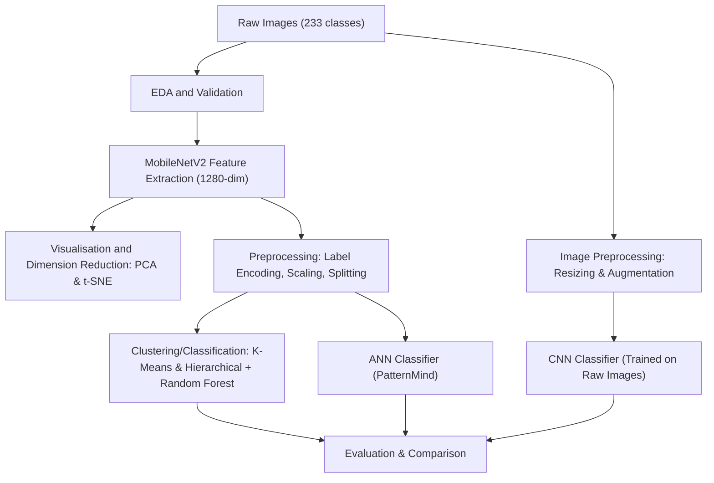
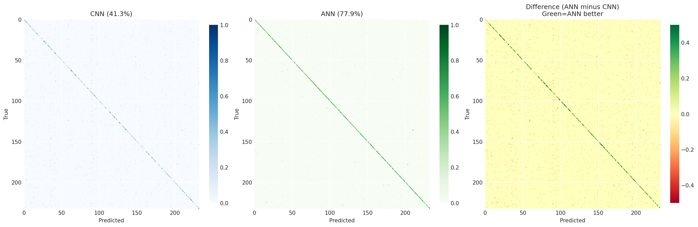
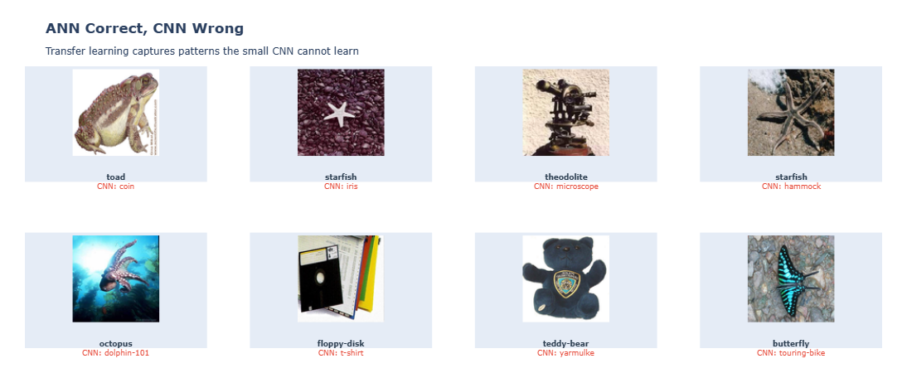

# PatternMind: Exploring Semantic Structures in Image Collections

## Team Members:

Alberto Maccanico - 321991

Claudio De Acutis – 312111

Lapo Chiaselotti - 308291

## **Section 1 - Introduction**

### FILES:

- main.ipynb -> Our main notebook containing all the analysis
- best_cnn.keras -> Our best CNN, saved so we can continue testing without re-training the CNN (1h30 min at minimum)
- setup_gpu.sh -> GPU setup for use in WSL
- .gitignore -> Contains all the local files we did not want to flood git with (logs from tensorboard, virual environments, dataset ect ect)
- README.md -> You're reading it
- image folder -> Contains all used plots (not plotly) used in project, under the subfolder old is all the old plots we used and decided to change, the subfolder unrendered_plots contains the final 3 outputs which struggle to render on colab, but render fine in Visual Studio Code while running.

In the **PatternMind** project we aimed to explore semantic structures within large and diverse image collections.

Our main focus was to **extract visual patterns and categories** using multiple machine learning techniques, with the goal of understanding similarity, thematic structure, and ambiguity across images.

We also compared the performance of different models to evaluate which approaches were most suitable and what insights each one could provide about the dataset.

The project is divided into six main sections:

1 .  **Preliminary setup:** importing libraries, dataset loading, inspection, and cleaning.

2 .  **EDA and feature extraction:** using MobileNetV2 to obtain high-level image features and analysing their distributions.

3 .  **Data preprocessing:** label encoding, feature scaling, and creating the train/validation/test splits.

4 .  **Clustering/Classification analysis:** applying K-Means and Hierarchical Clustering and evaluating them with Silhouette Score, NMI, and ARI to gauge how the feature space is distributed.

5 .  **Supervised learning:** training a CNN and an ANN (using the extracted features) for image classification and comparing their performance.

6 .  **Final comparison and conclusions:** summarising the models’ behaviour and the key findings.

---

## **Section 2 - Methods**

Once we had imported the Dataset and performed EDA, we used **MobileNetV2** to extract the features to make the images into useable vectors for clustering and (after alot of practice and testing with bad CNNs) so that we could eventually model a Neural Net solely based off the features of the image, due to memory constraints in testing the CNN. Since features were high-dimensional we applied:
-	**PCA**, that reduces 1280 to 2 or 3 dimensions (to allow us to visualise them)
-	**T-SNE**, which Captures local neighborhood structure and is Useful to visualize clusters and category overlap
We then applied some preprocessing to the datas in order to make them fit for model training
1. **Label Encoding**: Convert category names to integers
2. **Feature Scaling**: StandardScaler (mean=0, std=1)
3. **Stratified Splitting**: 70% train / 15% validation / 15% test
We tested two clustering algorithms:
•	**K-Means** (partition-based, centroid-driven)
•	**Agglomerative Hierarchical Clustering** (tree-based, bottom-up)
Both were run with 233 clusters (number of categories) to analyze how well visual features naturally group.
We also test breifly a classification algorithm, Random Forest.
We used as Evaluation metrics:
•	**Silhouette Score** to see cluster compactness and separation
•	**NMI** (Normalized Mutual Information) for cluster-label information overlap
•	**ARI** (Adjusted Rand Index) to explain cluster-label structural similarity
• **Confusion Matricies** to see where models fail

We first built the CNN whose imput would be the **raw 128×128 RGB images** and which was formed by **4 blocks**: 
-the first three to extract the feature thanks to the **convolutional layers**, and which applied each a rising amount of filters, in order to extract higher level features.
-The last one which contained **Global Average Pooling** to reduce the number of parameters and a **dense layer** to classify and interpret the extracted features.
-The **output layer**, that returns the class in which the photos belong.
The blocks also included **regularization** (**Dropout, BatchNorm, Augmentation**), to **avoid overfitting**.
Then we build the **ANN** that used pre-extracted MobileNetV2 features. Even in this case we created **three blocks**, which all had a **dense layer** with a decreasing number of neurons to interpret and classify the features. Even in this case we applied **BatchNormalization and Dropout** to stabilize training and avoid overfitting.   The ANN “patternmind” model was **both faster and more accurate** than the CNN one which had to deal with the **limited amount of RAM and the relatively small dimension of the Dataset.** The ANN had an almost **80%** accuracy, compared with the **42%** one of the CNN, and a very small training time due to the fact it could rely on **pre extracted features** and didn’t have to do it itself, as well as no additional image processing going on, just features at play.

---

## **Section 3 Experimental Design**

In this section, we describe the experiments conducted to validate our approach and compare different machine learning models applied to large scale image classification and structure discovery.

1) **Clustering and Classification on MobileNetV2 Features:**  
- Purpose is to evaluate whether semantic visual categories naturally emerge when applying unsupervised methods to highly dimensional visual features extracted from MobileNetV2.  
- Baselines we compared two standard unsupervised clustering algorithms:  
  • K-Means  
  • Agglomerative Hierarchical Clustering  
  Both baselines were run with 233 clusters, matching the number of dataset categories.  
  Then, we quickly ran our Classification algorithm to see how much labels helped in uncovering patterns in the semantic space:
  • Random Forest
- Evaluation Metrics:  
  • Silhouette Score  for cluster compactness and separation  
  • NMI (Normalized Mutual Information) that quantifies information overlap between clusters and true labels  
  • ARI (Adjusted Rand Index) which measures structural agreement between predicted clusters and true categories  
  • Confusion Matrix for Random Forest

2) **ANN Classification on MobileNetV2 Features:**  
- Purpose is to assess how well an Artificial Neural Network can classify images using pre-extracted deep features instead of learning features from scratch.  
- Baseline. The ANN was compared against:  
  • Clustering results 
  • The CNN trained directly on raw 128×128 images  
  This allowed us to understand how much performance comes from feature extraction  and how much learned processing.  
- Evaluation Metrics:  
  • Accuracy, the standard measure  
  • Training time, to compare computational efficiency  
  • Validation loss trends  
  ANN served as the baseline for the CNN.  

3) **CNN Classification from Raw Images:**  
- Purpose is to train a Convolutional Neural Network end-to-end and compare its ability to learn features directly from images against the ANN that uses MobileNetV2 features.  
- Baseline. The CNN was directly compared with:  
  • ANN classifier  
  • Clustering/Classification results   
  The ANN serves as a strong baseline because it benefits from MobileNet’s pretraining  
- Evaluation Metrics  
  • Accuracy , standard metric for the validation  
  • Validation Loss  
  • Interclass accuracy  
  • Confusion matrices comparison  
  These metrics illustrate that the CNN isn't as effective as the ANN that relies on high-quality pretrained features.

---

## **Section 4 - Results**

Our analysis of 25,683 images across 233 categories revealed three key insights:

**1. Transfer Learning in memory-limited environments beats from-scratch**

PatternMind ANN achieved **79.2% test accuracy** versus CNN's **43.1%** a 36-point gap. The ANN also trained 9× faster (10 minutes vs 90 minutes). Pre-trained MobileNetV2 features provide robust 1280-dimensional representations that immediately discriminate between categories, while the CNN (constrained by 8GB VRAM to 128×128 resolution) struggles to learn effective features for 233 classes with sparse data (70+ classes have <50 samples).

**2. Clustering Captures Feature Similarity But Not Boundaries**

K-Means and Hierarchical Clustering both achieved **NMI ≈ 0.74** (strong semantic correlation) but **Silhouette ≈ 0.02** (near-zero separability). Categories occupy overlapping regions rather than distinct partitions. Hierarchical dendrograms revealed natural groupings: early merges (<50 distance) for visually indistinguishable pairs {rifle, ak47}, {comet, galaxy}, while distinctive categories (faces, airplanes) remained isolated until final linkage (>200 distance). Clustering accuracy via majority voting reached ~63%, below supervised methods but above random chance (0.43%).

**3. Imbalance Creates Systematic Failures**

t-SNE projections show **survival of the fittest dynamics**: well-sampled classes (airplanes: 800 samples) form tight clusters with >85% accuracy, while minority classes (elk: 37, hibiscus: 29) fragment or collapse into neighbors (elk -> horse, hibiscus -> iris). The 10.26× imbalance ratio + 28% feature sparsity reduces effective dimensionality to ~920 features. Classification confusions concentrate in subcategory pairs (sneaker to tennis-shoe), rare class absorption, and polluted-categories ("clutter" scatters uniformly across space).

**Key Visualizations** :

- t-SNE: isolated manifolds for dominant classes, fragmented regions for minorities (made with plotly so in HTML and not visualisable via markdown)

---

## **Section 5 - Conclusions**

This project demonstrates that **the organisation of a visual space is dependent on so much more factors than data quality alone**. Our key findings: transfer learning is helpful for imbalanced, high-dimensional classification (36-point ANN-CNN gap) under limited memory costraints; clustering reveals semantic structure but not clean boundaries (high NMI, near-zero Silhouette); and failure modes are systematic confusions that concentrate in subcategory pairs, rare classes collapse, and polluted-categories. 

These patterns reflect dataset properties: 233 categories competing in ~920 effective dimensions with 70+ classes below 50 samples.

### Limitations and Future Work

**Unanswered Questions:**

Would the CNN perform better with a reasonable batch size? Would we have to adapt our Learning Rate and Optimiser in that environment?

Is there a way to naturally integrate the sub-classes into their larger classes without losing sophistication?

Could there be a way to remove clutter?

**Natural Next Steps:**

- Merge indistinguishable subcategories to reduce classes to ~180 while preserving diversity (Capture all of variance explained by dataset)

- Validate across fine-grained datasets (other image sets on Kaggle)

- Remove polluting categories that contribute nothing to the semantic space, but rather clutter it.
