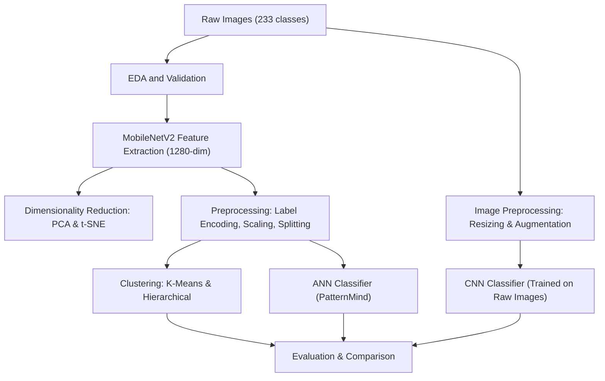

# PatternMind: Exploring Semantic Structures in Image Collections

## Team Members:

Alberto Maccanico
Claudio De Acutis 312111
Lapo Chiaselotti

# PatternMind: Exploring Semantic Structures in Image Collections

## Team Members:

Alberto Maccanico

Claudio De Acutis – 312111

Lapo Chiaselotti

## **[Section 1] Introduction**

In the **PatternMind** project we aimed to explore semantic structures within large and diverse image collections.

Our main focus was to **automatically extract visual patterns and categories** using multiple machine learning techniques, with the goal of understanding similarity, thematic structure, and ambiguity across images.

We also compared the performance of different models to evaluate which approaches were most suitable and what insights each one could provide about the dataset.

The project is divided into six main sections:

1 .  **Preliminary setup:** importing libraries, dataset loading, inspection, and cleaning.

2 .  **EDA and feature extraction:** using MobileNetV2 to obtain high-level image features and analysing their distributions.

3 .  **Data preprocessing:** label encoding, feature scaling, and creating the train/validation/test splits.

4 .  **Clustering analysis:** applying K-Means and Hierarchical Clustering and evaluating them with Silhouette Score, NMI, and ARI.

5 .  **Supervised learning:** training a CNN and an ANN (using the extracted features) for image classification and comparing their performance.

6 .  **Final comparison and conclusions:** summarising the models’ behaviour and the key findings.

## **[Section 2] Methods**

Once we had imported the Dataset and performed EDA, we used **MobileNetV2** to extract the features, since our idea was to then use an ANN that could actually distinguish between them and then compare it with a CNN trained only on the dataset. Since features were high-dimensional we applied:
-	**PCA**, that educes 1280 to 2 or 3 dimensions
-	**T-SNE**, which Captures local neighborhood structure and is Useful to visualize clusters and category overlap
We then applied some preprocessing to the datas in order to make them fit for model training
1. **Label Encoding**: Convert category names to integers
2. **Feature Scaling**: StandardScaler (mean=0, std=1)
3. **Stratified Splitting**: 70% train / 15% validation / 15% test
We tested two clustering algorithms:
•	**K-Means** (partition-based, centroid-driven)
•	**Agglomerative Hierarchical Clustering** (tree-based, bottom-up)
Both were run with 233 clusters (number of categories) to analyze how well visual features naturally group.
We used as Evaluation metrics:
•	**Silhouette Score** to see cluster compactness and separation
•	**NMI** (Normalized Mutual Information) for cluster-label information overlap
•	**ARI** (Adjusted Rand Index) to explain cluster-label structural similarity

We first built the CNN whose imput would be the **raw 128×128 RGB images** and which was formed by **4 blocks**: 
-the first three to extract the feature thanks to the **convolutional layers**, and which applied each a rising amount of filters, in order to extract higher level features.
-The last one which contained **Global Average Pooling** to reduce the number of parameters and a **dense layer** to classify and interpret the extracted features.
-The **output layer**, that returns the class in which the photos belong.
The blocks also included **regularization** (**Dropout, BatchNorm, Augmentation**), to **avoid overfitting**.
Then we build the **ANN** that used pre-extracted MobileNetV2 features. Even in this case we created **three blocks**, which all had a **dense layer** with a decreasing number of neurons to interpret and classify the features. Even in this case we applied **BatchNormalization and Dropout** to stabilize training and avoid overfitting.   The ANN “patternmind” model was **both faster and more accurate** than the CNN one which had to deal with the **limited amount of RAM and the relatively small dimension of the Dataset.** The ANN had an almost **80%** accuracy, compared with the **42%** one of the CNN, and a very small training time due to the fact it could rely on **pre extracted features** and didn’t have to do it itself.

The System Requirements are:
- Python 3.10+
- CUDA-compatible GPU (8GB+ VRAM recommended)
- WSL2 (for Windows users)

